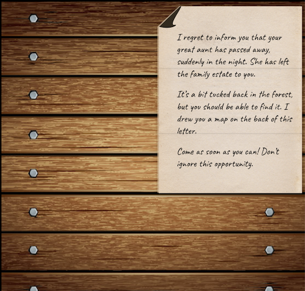
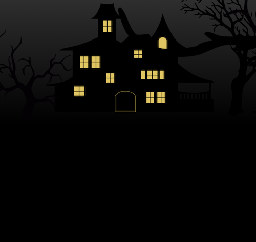
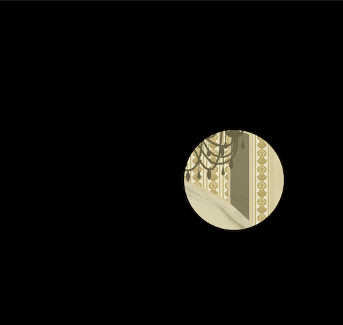
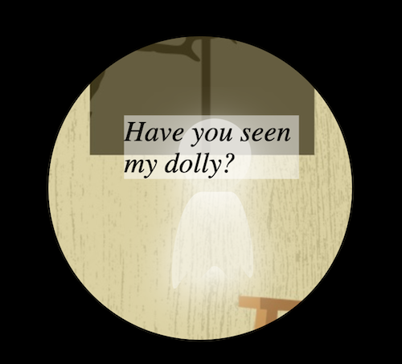

# Haunted House

#### _Front-End Development/UI - Week 4 - 3.5.19_

#### By _**Randee Layosa and Matt Groberg**_

## Description

_This app game uses CSS animations to bring the user an immersive haunted house experience. The user interacts with the app by navigate through the house by flashlight (a clipping mask around the mouse to mimic a flashlight), searching for clues to help the trapped ghost in hopes that it will help you escape. The game is not currently complete, but the app is meant more for demonstrating creative UI design._

## Preview
<p align="center">Screenshots</p>
<p align="center">




</p>

## Technologies Used

  * _JavaScript_
  * _CSS/Sass_
  * _HTML_

## Setup/Installation Requirements

#### To open and view this project file:
1. To view the live site, go to https://randeelayosa.github.io/hauntedhouse/.
2. Or, to view the project file, clone this GitHub repository https://github.com/randeelayosa/hauntedhouse.git to your Desktop.
  * Install git onto your computer if it isn't already.
  * To clone the project down to your desktop, open your Terminal, and enter the following commands:
  ```
  cd desktop
  git clone https://github.com/randeelayosa/hauntedhouse.git
  cd haunted-house
  atom .
  ```
  * _You can use another text editor if Atom is not your preferred program._
2. To view the live site, click the `index.html` file in the left side menu when you open the project in Atom. Drag and drop the index.html tab into the tab area of Chrome or the browser of your choice.

### Legal

*This software is licensed under MIT license.*

Copyright (c) 2019 **_Randee Layosa and Matt Groberg_**
